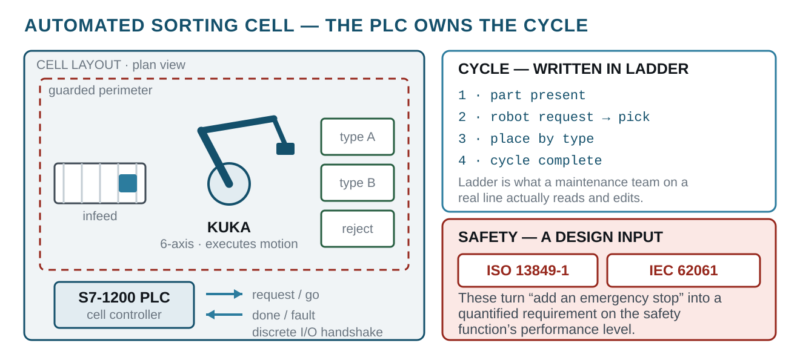

# Automated Sorting Cell — KUKA Robot + S7-1200 PLC
> An industrial pick-and-sort station: a KUKA arm sequenced by a Siemens S7-1200 PLC in Ladder, designed against recognised machine-safety standards.
`2025` · `KUKA` · `Siemens S7-1200` · `Ladder / TIA` · `ISO 13849-1` · `IEC 62061` · `Industrial automation`



## About

An industrial-automation project (with Chahin Dhaoui): an automated sorting cell built around a KUKA industrial robot that picks parts and sorts them by type, with a Siemens S7-1200 PLC as the cell controller and the two coordinated over their I/O handshake.

**The control lives in the PLC.** The sequencing — part present, robot request, pick, place, sort-by-destination, cycle complete — is written in Ladder on the S7-1200, which is the language a maintenance team on a real line actually reads and modifies. The robot executes motion; the PLC owns the logic, the interlocks and the cycle.

**Safety was a design input, not an afterthought.** The cell is specified against **ISO 13849-1** and **IEC 62061** — the standards that turn "add an emergency stop" into a quantified requirement on the safety function's performance level. Designing to them is the difference between a demo and something that could stand next to a person.

## Contents

```
docs/
```

## Notes

DOCUMENTATION ONLY - the deliverable was the cell design and its PLC ladder, written up as a report. The report PDFs are in `docs/`.

## Documents

| File | What it is |
|---|---|
| [`docs/rapport_kuka_mahmoudi.pdf`](docs/rapport_kuka_mahmoudi.pdf) | Full project report (FR), Mahmoudi Assaad and Dhaoui Chahin, ENIG GEA 2025-2026 |
| [`docs/latex/rapport_kuka_mahmoudi.tex`](docs/latex/rapport_kuka_mahmoudi.tex) | LaTeX source of the report |
| [`docs/KUKA_presentation.pptx`](docs/KUKA_presentation.pptx) | Defence slides: KR6 R900 + KRC4, I/O table, GRAFCET, Ladder networks, PROFINET mapping, safety functions |

The cell uses a **KUKA KR6 R900** on a **KRC4** controller, driven by an **S7-1200** over **PROFINET IO** (8 ms cycle). The cycle times, throughput and E-stop response figures in the report are **simulation results**, not measurements on a physical cell.

## Third-party work used here

Everything in this repository is my own work. It builds on the following, which are **not** mine and are used under their own licences:

- **KUKA KRL / KUKA.Sim** by KUKA — <https://kuka.com>
- **TIA Portal, S7-1200** by Siemens — <https://siemens.com>

## Author

Lassaad Mahmoudi — <assaadmahmoudi0@gmail.com>  
https://linkedin.com/in/mahmoudiassaad
